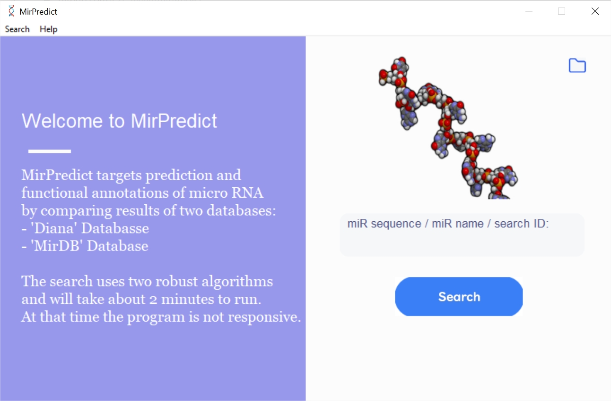

  MirPredict
====================
MirPredict is a small app that is targeted at mapping micro RNA into their
corresponding RNA by using the two biggest engines: 'Diana' and 'MirDB'.
The app uses headless selenium browsers to scrap the data from the web, and 
then analyse it. The search proccess includes using data from three additional
data sources: 'ensembl', 'MirBase' and 'proteinatlas'. 

### Download & Install
1. Click the links below to download a setup file.
2. Install it localy on your PC. 

| Version      | Link |
| ----------- | ----------- |
| 0.5 | [mirPredict_v0.5](https://drive.google.com/file/d/19THfX3aZCVVAPc10DKsL8lz4ab0WXYgG/view?usp=sharing) |

### Tissue Expression
The Data is taken from www.proteinatlas.org database and contains four categories
of reliability: Approved, Enhanced, Supported, and Uncertain. In the app all
the Entries with reliability of Uncertain were omitted
In addition the levels of expressions are set from High to not detected
while there is another category 'Not Representative' which is ommited from
query.
